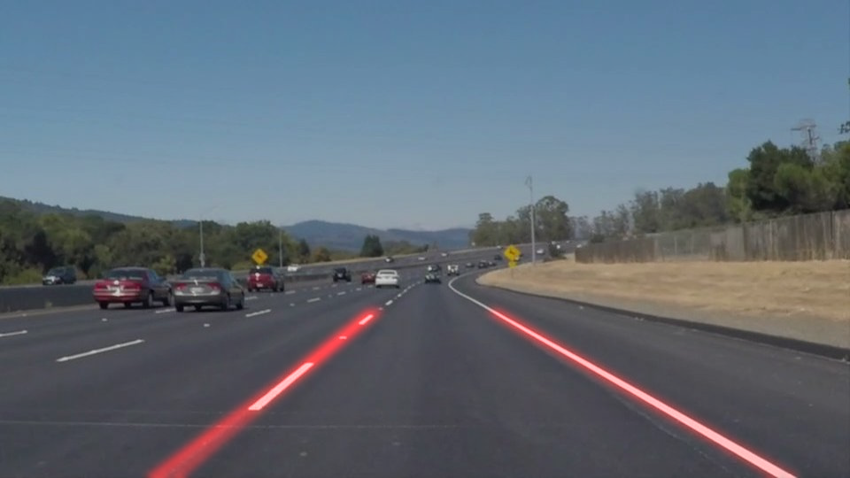

# **Finding Lane Lines on the Road** 

## Writeup Template

### You can use this file as a template for your writeup if you want to submit it as a markdown file. But feel free to use some other method and submit a pdf if you prefer.

---

**Finding Lane Lines on the Road**

The goals / steps of this project are the following:
* Make a pipeline that finds lane lines on the road
* Reflect on your work in a written report

[//]: # (Image References)

[image1]: ./examples/grayscale.jpg "Grayscale"

---

### Reflection

### 1. Describe your pipeline. As part of the description, explain how you modified the draw_lines() function.

My pipeline consisted of 7 steps. First, I converted the images to grayscale. Then I applied canny edge detection with low_threshold=50 and high_threshold=150 to generate the image of edges. Next I used inRange to generate a color mask containing yellow and white and then applied bitwise_and of it to the image of edges to only preserve those edges with yellow or white. Next, I used hough_lines to detect the lines in the color-masked image of edges. Next, I masked the image of lines from Hough transform with a polygon region by the region_of_interest function. Then, I applied Gaussian blurring to combine nearby lines. Finally I used weighted_img function to annotate the original image with our found lanes.

In order to draw a single line on the left and right lanes, I modified the draw_lines() function by examining the slope of each line. If the slope is near 0 or infinity, then I ignored the line, otherwise I extended the line to be longer. To merge nearby lines, I later used Gaussian blurring with kernel size 31.

Below is an example output:

### 2. Identify potential shortcomings with your current pipeline

One potential shortcoming would be in the annotated video, there are extra noisy lines sometimes, as can be seen in the videos.

Another shortcoming could be in the final challenge video, the pipeline failed to ignore other noisy lines.

### 3. Suggest possible improvements to your pipeline

    line_img = hough_lines(color_masked_edges, rho=1, theta=np.pi/180, 
                           threshold=25, min_line_len=10, max_line_gap=int(0.3*imshape[0]))    
                           
A possible improvement would be to make the inputs of hough_lines function more restrict. For instance, increase threshold, increase min_line_len, and decrease max_line_gap a little. This works very well to remove noisy lines for all the images and videos except the last challenging video.

Another potential improvement could be to modify draw_lines() so that is only draw two lines. This shall includes the work of estimating the lane slopes in order to remove noisy lanes and averaging lines representing the same lane into one line.
